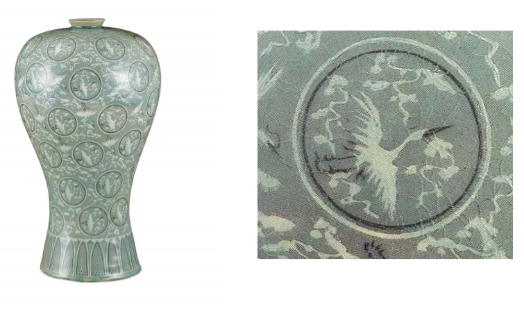
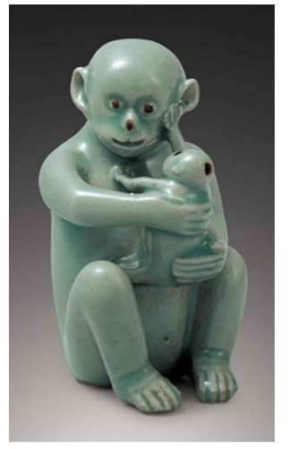

# 한국사 탐구.

## 1)KOREA, 고려의 성장과 변화

### 고려의 건국과 왕건

1. 궁예폐위 -> 918 왕건 고려건국
2. 수도 개성. 935 신라 경순왕 항복 936 후백제 항복 통일
3. 자체적 통일. 발해유민 받아드림
4. 왕건선대 고구려유민. 중국과 해상무역
5. 작제건 상선을 타고 서해항해. 용건 (아버지) 송악의 대호족
6. 고려 건국후 개성 왕씨사용 > 왕실만 쓰던 성의 사용 본격적 확산.
7. 유력호적,협력한자 성을 하사. 지방제도 정비, 지방에도 성 보급.
8. 100가지 성이 생김. -> 백성 : 고려시대 백성 = 지배층

### 훈요십조

1. 왕건이 남긴 열 가지 유훈.
2. 차령산맥 이남 역모의 땅. 그사람들 등용하지 말라.
3. 죽기전 박술희를 궁으로 불러 전해줌.
4. 세자의 후견인으로 후백제 호족 출신인 박술희를 삼아 후계기반 확실히함.
5. 세자(전라도 나주), 박술희 도 동일. 아이러니.
6. 혜종 -> 나주로 피난.
7. 혜종 피난이후 나주지역 인사들 다수 중용을 견제하기 위함으로 만들어낸것 같음.

### 성과 본관

1. 갑오개혁 이후 신분제 타파
2. 호적제인 민적법
3. 귀화한 성 포함 (연안인씨, 청해이씨, 경주섭씨, 충주매씨,남양제갈씨,우륵김씨)

### 고려 사회의 특징

1. 불교국가.
2. 정치: 유교
3. 세력: 왕족 귀족관료 2성6부
4. 신분제 사회. 귀족-중인-평민(농민-대다수,상인 수공업자-> 농민보다 낮음 )-노비
5. 중인 : 향리, 하급장교. 노비 : 공,사노비. 매매, 증여, 상속가능.
6. 관리 : 과거제 5품이상 고위관료자제 -> 음서제 (특헤)
7. 귀족들 사이 문벌귀족이 등장. 무신정권 이후 친원세력 등장.

### 고려 사상

1. 유교사상. 유학공부. 삼ㅅ국사기 편찬.
2. 훈요10조 : 불교강조.
3. 교종중심 의천 천태종. 선종중심 지눌 조계종
4. 고려후기 원으로 유학. 성리학 들어옴. 신진사대부의 사상적 기반.

### 고려의 여성

1. 고려시대 -> 여성 이혼가능.
2. 남편이 먼저 죽으면 친정으로 돌아가 생활. 재혼도 자유로움
3. 남녀평등. 재산상속 동등, 아버지 사망 시 어머니가 호주. 일부일처제.
   * 최루백의 부인 염경애의 묘지명. -> 부인의 생애를 시와 산문으로 압축기록.
   * 묘지명 -> 고려시대의 문화유산. 묘비명과 다르다. 여성의 묘지명 많음.
   * 여성의 실명이 기록된 유일한 경우.

### 고려청자

1. 고려시대 대표 문화재
2. 청자 : 자기에 바르는 유약 가운데 미량의 철분이 있어 구워 지는 과정에서 청록색의 유색을 띠게 되는 도자기.
3. `강진`, `부아`, `요`에서 고유의 청자를 만듬.
4. 2세기 무렵 중국에서 제작, 삼국시대에 한반도에 전해짐.
5. 고려에서 본격적으로 발전. 초기 암녹색, 녹청색등 어두운편. 문양도 없음.
6. 우리나라 청자 제작의 시원 `국보 326호` `청자 순화 4년명 항아리`
7. 고려 재토를 빌롯한 선대왕들의 제사를 하는 태묘에서 사용하고자 제작된 왕실 제기.

* 황해남도 배천군 원산리 야산 능선에 위치한 고려 초기 자기가마터. 북한국보급 제166호

* 명칭으로 이해하는 도자기

1. 도자의 종류(청자, 배자)
2. 문양표현기법(상감 등)
3. 안료(청화, 철화, 진사 등)
4. 문양(-문 등)
5. 형태 (병, 주전자, 접시)

* 12세기 고려청자의 절정기. -> 천하제일 비색청자.

**비색 : 비밀스러운 빛깔. 중국 문헌에도 고려비색이 천하제일로 기록되어있음.**

* 중국에서 고려청자에서 흑백의 상감기법을 개발하여 청자에 아름다운 문양을 더한 상감청자로 발전하였으나, 문양문제 해결 못하고 백자로 넘어감.	

### 국보 고려청자

* 현제 국보로 지정된 고려청자는 모두 20여 점 뿐.
* 해외로 유출된 것 중에 국보급이 오히려 더 많다.
* 대표적인 국보 청자 : `청자상감운학무늬매병(국보 68호)`

* 매병 : 매화꽃 한 가지를 꽂아서 노히 좋다 하여 붙여진 이름으로 알려짐.
* 사실 꿀과 참기름을 담는 생활용기 였음이 확인됨.

---

* 값비싼 예술품으로 감상용으로 생각되지만, 고려시대에는 대부분 실생활에서 사용하는 생활용품으로 만들어졌다. 주로 일반 백성보다는, 귀족 계층의 집에서 음식을 담는 등 일상에서 사용된 공예품이었다.
* 귀족들의 취향이 반영된 형태.
* 청자의 특징
  * 각종 동식물의 형태를 응용함. 참외를 쏙 빼 닮은 걸작.-> 12세기 작품
  * `국보 94호` 경기도 파주에 인종의 능인 장릉에서 발견.
  * 그 밖에 음식을 담는 용도 외에도 청자로 제작된것. -> 벼루에 먹을 갈 때나 물감을 갤 때 쓰기 위한 적은 양의 물을 담아두는 연적.
  * `국보 270호` 청자모자원숭이 모양연적.
  * 

### 금속활자

* 현존하는 세계 최고의 금속활자본 1377년 청주 흑덕사 `직지심체요절`
* 1447년 서양 최초의 금속활자 구텐베르크 보다 100여년 이상 앞서있음.
* 왕실과 귀족(사대부)를 위한 것.
* 영어 알파벳은 26자 이지만 한자는 공식적으로 5만자가 넘음.

## 2)500년 역사, 조선의 기록문화.

### 무예도보통지 

* 정조때 편찬.
* 한중일의 무예서 140여권을 비교 분석한 책.
* 북한에서는 현대 북한 태권도의 원형으로 평가.

### 기록문화 발달.

* 배경 : 세계기록유산 16건 부유. 아시아1위 세계 4위
* 조선시대 기록물: 10건 (실록, 승정원일기, 훈민정음해례, 의궤, 동의보감 등)
* 조선시대 대표 국보급 문화재들 : `책` 

> 삼국~ 고려시대 국보급 문화재들 대부분이 불교 관련 예술품.

* 조선시대의 기록 : `생활과 정치의 거울`

> 거울이 있어야 자신을 반성할 수 있다.
>
> 병인양요 때 프랑스 군이 강화도 점령후 강화도의 책들을 보고 조선인의 높은 교육열에 자존심이 상한다고 본국에 보고함.

* 개화기 : 서양인들 중국-> 상인의나라, 일본-> 무사의 나라, 조선-> 학자의 나라.

#### 실록

* 사초

  * 사초 ; 사관이 국무회의 때 왕의 좌우에서 한 사람은 왕의 행동을, 다른 사람은 왕과 신하의 대화를 기록. 카메라와 녹음기 역할.

* 태조~철종 25대 472년간 역사를 편년체로 기록. 총1893권 888책으로 되어 있음.

* 승정원일기

  * 승정원(비서기관)에서 기록한것.

  * 신하들에게 내린 왕명, 신하들이 올린 건의사항을 일기체로 기록.

  * 국내 현존하는 기록물 중 가장 분량이 많은 책

#### 일성록

  * 정조가 세손인 어린 시절부터 매일 반성하며 살겠다는 뜻으로 기록한 일기.
  * 왕이 된 이후로도 씀.
  * 왕의 일상을 보다 상세하게 기록.

#### 의궤

  * 왕실의 주요 행사 기록.(제사, 혼례, 장례, 잔치, 세자or세자빈 책봉, 외교사절 접대, 궁궐의 축조 등.)
  * 조선전기부터 제작. 양란이후 대부분 손실. 
  * 남은것은 대부분 조선후기에 제작된 것.

#### 보관

* 전기 한양의 춘추관, 지방 4곳의 사고

* 왜란이후 5대로 변경.

* 근대이후

  * 서울대학교 규장각 : 서적위주.
  * 한국학중앙연구원 장서각 : 문서위주.

  

#### 활자책의 보급

* 나무활자, 금속활자 발전.
* `조선왕조실록` 은 초기에 필사를 하다가, 세종대부터 명종대 까지 금속활자로 간행함.
  * 임진왜란 이후 실록이 소실되자, 이후부터는 빠른 복구를 위해 목활자로 만듬.
  * 현종~철종 다시 금속활자로 간행.
* `동의보감` : 허준 간행. 2009년 세계기록유산에 등재.
  * 해부학원리에 입각한 의학.
  * 각종 약재 사용법 등 의학적으로 임상적인 가치가 높다.
  * 신체 해부도인 ``신형장부도` 가 해부학적 맥락에서 연구한 증거.
  * 명주실 봉합법, 대나무 깁스법 등 존재.

### 독서습관

* 새벽에 잠 깨면 `논어` 본문 한 편을 묵묵히 외운다.
* 대부분 전문을 외움. 속으로 읽기, 성독.
* 다산 정약용.
  * 포천 수레에 책을 가득싣고감.
  * 일주일뒤 가보니 다 읽었음.
  * 그 책은 송나라의 사마광이 쓴 `자치통감강목`

* 필독서 : 사서 삼경
  * `사서` : 논어, 맹자, 대학, 중용
    * 주자학 설명하는 책
  * `삼경` :  시경, 서경, 주역
    * 공자 등이 전통 경전.
* 소설책
  * `번역중국소설` : 삼국지, 수호지, 서상기 등. 
  *  `중국을 무대로 국내에서 창작한 소설.` : 구운몽, 숙향전, 유충렬전 등.
  * `우리나라 사람을 주인공으로 창작된 소설` : 춘향전, 심청전, 임경업전 등. 
  * 부녀자들의 지나친 소설책 사랑 -> 불온책으로 여러 주의해야 한다고 인식되기도 함.
    * 유교이데올로기의 관점에서 본 불온서적 -> 판타지소설.

#### 홍길동전

* 조선후기 문학으로 적자와 서자의 신분차별을 비판하는 사회소설이자, 최초의 한글 소설.

* 명문 양천 허씨 집안에서 태어나 어려서 부터 글솜씨가 뛰어남.

* 허균의 다른 문학작품

  * `남궁선생전`, `손곡산인전`, `엄처사전`, `장산인전`, `장생전` 등 인물 전기를 여러편 씀. 순 한문체
  
* 광해군 10년 -> 대북파의 중심 허균 역모로 능지처참을 당함.

### 하멜표류기

* 서양을 조선에 알린 최초의 기록.
* 네덜란드 무역선.
* 벨테브레 -> 훈련도감에서 근무. 하멜의 통역을 맡음
* 포류를 쓴이유 : 13년간 밀린 봉급을 받귀 위해 표류의 증거가 필요했기 때문.
* 2부로 구성
  * 1부 : 난파와 표류
  * 2부 조선왕국기라는 제목.
    * 17세기 조선시대 모습을 보여줌

## 3)조선후기 신지식인. 실학자들의 이상과 현실

### 실학

#### 실학이란

* 현실 개혁의 학술 및 사상을 가리키는 개념.
* 현실중시 개혁강조.
* 1930년대 `실사구시학` 이라 구분한 것을 줄여 `실학`이라 부름.

#### 결과

* 새로운 시대적 변화를 강력하게 의식하고 요구한 하나의 흐름.
* 생활을 위한 학문.

#### 탄생 

* 개혁을 통해 국가의 운영과 백성들의 삶을 향상
* 서양문물의 전래를 통해 관념의 세게가 아닌 객관적인 세계인식.
* 기존의 `인의예지신`이 아닌 정치경제, 산업사회, 과학, 역사지리 등과 같은 현실적인 문제를 고민, 개혁연구

#### 초기대표

* 유형원 
  * 반계수록 : 자작농을 기초로 한 토지제도개혁.
  * 노비제도 폐지, 상업의 진흥등 파격적 제안.
* 경세학 -> 경세학
* 박세당 -> 농학(경제)
* 김석문 -> 천문학

#### 18세기 이후 실학

##### 학파로 발전

* 18세기 전반 : 이익 중심의 경세치용 학파.
  * 국가의 제도 개혁을 목표.
* 18세기 후반 : 박지원 중심의 이용후생 학파.
  * 상업의 진흥과 기술개발 목표.
* 19세기 전반 : 김정희 중심의 실사구시 학파.
  * 학문연구에 있어 실증을 목표.

##### 이익

* 경세치용 학파 : 농민들을 위한 개혁

* 조선 최고의 경세가
* `성호집`, `성호사설` : 정치의 근본은 민생의 안정과 백성의 보호.

##### 이용후생학파

* 박지원, 홍대용, 서유구
  * 연암 박지원 
    * `열하일기` 선진문물과 서구적 제도의 도입을 적극 주장.
    * `양반전` 양반의 실상을 풍자적으로 고발.
  * 홍대용
    * 지동설이 유입되기전 지전설을 주장.
    * 중화사상배척.
    * 자연과학에 몰두
  * 서유구
    * `임원경제지` : 일종의 백과사전.
    * 농학, 천문학, 공학, 수학, 요리, 의학, 어업, 예술, 상업 등 16분야에 걸쳐 무려 113권의 저서로 남음.
  * 유배생활 : 정약용, 서유구
* 도시민을 위한 개혁(상업)
* 상공업의 발전과 기술개발 중요시.
* 청나라를 배우자는 `북학파`라고도 불림.

##### 정약용

* 경세치용과 이용후생의 종합.
* `경세유포``를 통해 전국토를 도로망으로 연결.
* 국가개혁론 제안 : 하루생활권 분할, 권역별 도시와 농촌으로 구성.

##### 김정희

* 실사구시학파
* 조선중심 연구
* 역사, 지리, 문헌 등 꼼꼼히 연구.
* 진흥왕 순수비 연구

### 중국의 고증학, 일본의 고학

* 중국, 일본도 실학과 비슷한 학풍.
* 중국 : `경세치용`, `실사구시` 중심
* 일본 : 서양문물을 일찍부터 받음. `고학`, `난학` 발달.

* 중국 : 유학 -> 고증학으로 변경.
  * 명분의리 보다 인간의 본성이 보다 중요시.
  * 문학, 역사, 철학 등에서 비판적 연구가 필요하게 됨.

### 17세기 서양문물의 전래

#### 연행사

* 중국에 다녀온 뒤 서양문물 전래.
  * 곤여만국전도
* `지봉유설` 에 세게지도, 천문학, 서양풍속등 전래됨.
* 천리경, 화포, 자명종, 안경 등 전래.

#### 통신사

* 일본과의 외교적 임무를 수행하기 위해 사행단을 보냄.
* 외국에 가는 것은 공식적인 사행 외에는 허용되지 않음.

#### 중국으로부터 들어온 서양문물

* 홍이포
  * 네덜란드 대포.
  * 명의 기술자를 영입하여 스스로 제작하기 시작함.
  * 1636년 병자호란
  * 훈련도감에서 이를 제작하여 실전에 배치.
* 안경
  * 명나라 사행단 일원 김성일
  * 거북이 등껍질로 테를 만들고, 끈으로 연결한 일명 `실다리 안경` 으로 유럽에서 유행.
  * 17세기 들어 조선사회에 크게 보급

#### 일본으로부터 들어온 서양문물

* 조총
  * 임진왜란 1년 전 1591년 대마도주가 조선의 선조에게 선물로 조총을 처음 전함.
  * 위력을 인식하지 못하고 결국 임진왜란에서 크게 패함.
  * 이후 노획한 조총을 모방에 자체 제조에 성공, 대량보급의 길을 열게 됨.
  * 주력 무기로 거듭남.
* 천리경
  * 영국에서 처음 만든 굴절망원경.
  * `데지마`를 통해 수입.
  * 정두원에 의해 전해짐.
* 자명종
  * 영국에서 처음 제작.
  * 천체 관측에도 이용.
  * 정두원에 의해 전해짐.
  * 원리를 탐구하여 혼천시계를 제작하는데 이요함.

#### 개혁의 전개

* 양란이후 황폐해진 조선사회
* 공물을 쌀로 대신하는 대동법을 실시.
  * 농업생산력 향상.
  * 금속화폐 필요 느낌.-> 상평통보 유통

### 시볼트

* 조선에 대한 관심.

### 혼천의

* 태양계 행성 위치를 측정하는 천문기구.
* 최초 : 중국 
* 조선 : 1433년 세종15 에 만듬.
* 천문학의 발달.

#### 천구의 : 별자리 관측도

### 과학

* 실학에서 발전.
* 서양의 자연과학으로 변화, 실학-> 이를 수용, 소멸.

## 4)근대화의 꿈, 대한제국의 흥망

### 개요

* 대한제국의 사건들
  * 1876년 강화도조약
  * 1882년 임오군란
  * 1884년 갑신정변
  * 1895년 을미사변

### 역사

* 1897년 봉건사회 붕괴.
* 서구 제국주의세력의 침략 직면.
* 왕이 아닌 `황제`로 격상, `광무`라는 연호 사용.
* 자주 독립국가임을 알림.

### 대한제국

#### 의미

* 근대국가로 중국과 동등하게 서려는 입장에서 `조선`이름을 버려야 했다.
* 조선 다음으로 가장 많이 사용한 호칭 `한` + 이를 높이는 호칭으로 앞에 `대`자를 붙이자고 고종이 제안.
* 고종은 중국과의 전통적인 관계를 청산하려는 의식이 강하게 작용함.
* 환구단 : 대한제국을 선포한 곳.

#### 주측세력

* 독립협회 : `민국`을 만들기 위해 의회를 세워 정치 참여를 확대함.
* 황국협회 : 국론분열을 막고 황제 중심으로 힘을 모아 제대로 된 제국을 만들고자 함.
* 고종은 황제권 강화와 군대 강화 등에 역점을 두는 `광무개혁`을 시도함.

### 구본신참

* 고종의 근대화의 지표, 자주 독립국가로서 `구본신참`을 강조.
* 본으로 삼는다는 옛 것은 조선왕조가 500년 간 쌓아온 문화적 성과.
* 즉 전통적 문화를 근간으로 서양의 새로운 기술문명을 받아 거듭나겠다는 것.
* 집권층의 보수적인 성향과 일본의 간섭 때문에 큰 성과를 거두지는 못함.
* 을사늑약 으로 일제에게 외교권을 빼앗기면서 중단됨.

### 대한제국, 고종황제를 보는 시각

*  감정적으로 보는 시각.
* 우울한 이미지.
* 미진한 연구성과 만큼, 당시를 바라보는 시각 또한 옭고 그름의 올바른 판단을 할 수 없다.

#### 대한제국

* 타락한 부패국가, 구체재를 못 벗은 봉건국가.
* 한국사에서 `근대개혁`은 일제강점기 때이고, `산업화``도 식민지 근대화의 성과라고 주장함.
* 근대국가로 나아가기 위한 대한제국의 노력을 긍정적으로 평가.
* 일제강점기 -> `근대개혁`도 `산업화`도 아닌 `근대를 박탈당한 시대` 라고 주장.

#### 고종황제

##### 부정적 시선

* 고종의 정치이념으로서는 근대국가를 세우기에는 이미 한계가 있었다는 주장.
* 나라 재정을 자신의 주머니로 여겨 사치품 구임 등에 낭비, 매관매지을 방조

##### 긍정적 시선

* `민국`을 위한 개혁군주, 자력으로 근대화를 이루고자 노력했던 인물.
* 서구 문명을 적극 수용하고 신분제를 폐지
* 외교적 중립노선을 표방한 독립국 지위를 억고자 노력

##### 반성, 비하?

* 비판적 평가 -> 과거 일제강점기 일본인들이 우리에게 심어 놓은, 그리고 해방 이후 우리 스스로 확대 재생산한 `자기비하`와 구분해야함.
* 관대한 시선 또한 올바른 평가가 아님.

##### 잘못된 시선

* 근원 황현(소론)의 `매천야록`
* 고종의 역사를 편년체로 서술한 책
* 들은 것과 본 것을 자신의 견해를 넣어 기록.
* 고종과 왕비에 대한 비판이 담김.
* 기꾸찌 겐죠(왕비 시해사건 가담자) `대원군전 왕비의 일생` -> `매천야록` 참고해서 씀
  * 황후를 부정한 여인으로 왜곡시켜 대원군을 도와주고자 살해했다는 낭설을 펼침.
  * 고종 : 유약하고 무능한 존재로 둔갑.

##### 고종의 꿈의 세상

* 조일수호조규(`강화도 조약`) -> 운요호 사건 계기로 강요에 의해 체결 -> 병합 후 일본이 조작한것.

###### 고종의 근대화 추구 시련.

* 대원군 정사에서 물러나게 한 후 첫 근대화 조치 : 강화도 조약.
* 이를 배우고 조미수호통상조약을 체결함.

#### 임오군란

* 청의 군대파견 -> 속내: 조선과 미국이 가까워지면서 청국의 영향권을 벗어나려는 것을 막기 위함.
* 일본 교관 피살, 공사관 피해 -> 일본은 책임 추궁과 보상 요구
* 일본을 최혜국으로 관세를 대폭 인하.
* 미국, 영국도 동일조건 요구
* 국가적 큰 손실. 개화정책 수렁에 빠짐.
* 청국의 속방화 정책 최소화 하기위해 서양과 국교 수립 특히 러시아.
* 동학농민군 진압구실 청군 일본군 동시 출병 -> 청일전쟁까지 번짐.

#### 을미사변

* 친러의 결과
* 고종 -> 러시아공사관으로 임시 거처를 삼는다.(아관파천)

#### 근대화 사업 시작.

* 을미사변 이후 일본은 조선에 더이상 간여 할수 없게됨.
* 고종의 한반도 북부 광산개발.
* 영국의 `금본위제` -> 광산개발 투자유치에 노력.
* 미국 도시개조사업 -> 경성
* 전차개통.
* 서북철도 사업 시작 -> 프랑스
* 벨기에 수호통상조약-> 국고은행으로 대한천일은행 발족.

#### 고종의 자주적 외교정책

* 벨기에와의 국교 수립.
  * 벨기에, 스위스 국제사회가 인정하는 독립국가.

* 한청조약 : 청과의 조공책봉 역사 씻음

#### 고종의 최후

* 서북철도 부설권 -> 일본에 의해 저지.
* 러일전쟁 이후 대한제국의 근대화 성과 무력화.
* 보호조약에 강제로 맞서다 헤이그 특사 파견사건으로 일본 통감부에 의해 강제로 퇴위.
* 자녀들 대부분 단명.

#### 대원군, 고종, 명성왕후에 대한 오해.

* 조선말 최고 권력층 내부의 갈등이 조선의 망국 원인이었다는 식민사관의 논리.
* 대원군과 명성왕후의 갈등.
* 명성왕후 : 살해당한 지 2년만에 황후로써 성대한 장례식을 치루게 됨. `어제행록`

#### 명성황후를 둘러싼 남은 쟁점들

##### 첫째, 호칭

1. 민비
2. 민왕후
3. 명성황후
4. 명성왕후

##### 둘째, 명성황후 사진에 대한 진위 논쟁.

#### 대한민국은 대한제국의 계승

* 1월 21일 고종이 승하.
* 3월 3일 장례식을 앞두고 예행연습을 하기로 한 3월 1일, 경운궁 대한문 앞 광장은 전국에서 수만의 인파가 몰려 듬. 일부 탑골공원으로 모임. `3.1.운동`
* 원래 임시정부의 국명은 `조선공화국` 하지만 그날의 만세 함성을 죽은 고종의 뜻을 기억하자는 백성의 소리로 대한제국을 계승하는 민국으로서 대한민국이 되었다.
* 일제 -> 상해임시정부를 세운 사람들이 조선왕조를 이은 대한제국이나, 망국의 원인을 준 무능한 고종을 마치 부정해서 만들었다고 왜곡함.

## 5)일제강점기, 강한 조선을 위한 꿈.

### 	대한민국의 스포츠 사랑

* 경기에서의 승리 -> 국가의 승리로 간주.
* 일제강점기 나라 잃은 설움을 떨쳐버릴 수 있던 수단 중 하나.

### 근대 스포츠의 도입

* 지덕체의 중요성.
* 황성기독교청년회(YMCA 전신)가 설립되면서 5개의 스포츠가 소개되고 보급(야구, 축구, 농구. 정구. 수영)

### 일제강점기 스포츠활동

* 1910년 체육활동 제한

* 3.1운동 이후 항쟁 수단으로 다시 체육활동 이루어짐.

* 전문 체육인 등장.

  >  당시 대다수 조선인 엘리트들, 일본 민족을 동경하며 우리의 자화상을 `민족적 콤플렉스`로 정리함.`춘원 이광수`

* 신채호 : `대한매일신보` -> 덕, 지, 체 중에서 체육이 가장 중요함.

  > 강한 체력이 강한 정신, 곧 독립을 위한 꿈을 키울 수 있다.

### 대표 조선체육인.

#### 월남 이상재

* 개화파 지식인.

* 우리나라 근대 체육의 기반을 가진 인물.

  > 스포츠 지도자 = 사회지도자. 
  >
  > 민족의 독립을 위해선 체육활동이 중요하다.

* 제1회 전조선야구대회 시구자.

#### 몽양 여운형

* 독립운동가이자 정치인.
* 상해임시정부 시절 야구경기장에 갔다가 체포돼 3년형을 살았음.
* 마라톤 축구 등 각종 격기 후원과 주체에 나섬. 
* 그의 격려사를 듣기 위해 경기장에 오는 인파고 엄청 남.

> "제군은 비록 가슴에 일장기를 달고 가지만, 등에는 한반도를 짊어지고 간다는 것을 잊어서는 안된다." - 여운형 -

#### 서상천

* 역도 도입인물.
* 역도대회 개최, 체조 및 역도 관련 교재를 출간, 선수양성.

#### 엄복동

* 자전거 가게 배달 점원.
* 자전거 타기를 익혀 나중에는 선수로 활동.
* 여러 자전거대회 우승.

> '하늘에 안창남, 땅에 엄복동'

* 여러 대회우승 -> 일본의 방해와 엘리트 선수들을 이겨내고 이룬것.
* 과학적이고 체계적으로 훈련.

#### 손기정

* 일제강점기 등짐장수, 물장수, 인력거꾼, 냉면, 신문배달 등 `달리는 직업`이 등장하면서 젊은이들이 시내를 뛰어 다녔고, 이들이 달리기대회에 나가 상을 타기 시작했다.
* 1936년 베를린올림픽에서 한 많은 금메달을 목에 걸게 되면서 꽃을 피움.

##### 조선신궁?

* 일제가 서울의 남산 중턱에 세운 가장 격이 높은 신사.
* 대규모 체육대회를 개최.
* 운동선수들의 꿈.
* 달리기 선수들이 두각을 나타내면서 민족적 열등감 극복.

#### 일장기 말소사건의 주역 이길용.

* 손기정의 자랑스럽게 고개를 들지 못하는 것을 통탄히 여겨 그의 가슴에 일장기를 지우고 보도한 동아일보 기자.
* 이후 신문은 11개월간 정간.
* 관련자들 45일간 고문, 언론계 떠나는 서약을 하고 쫓겨남

 

 